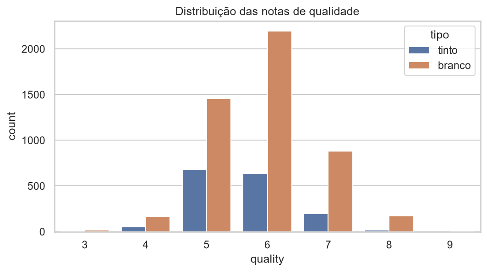
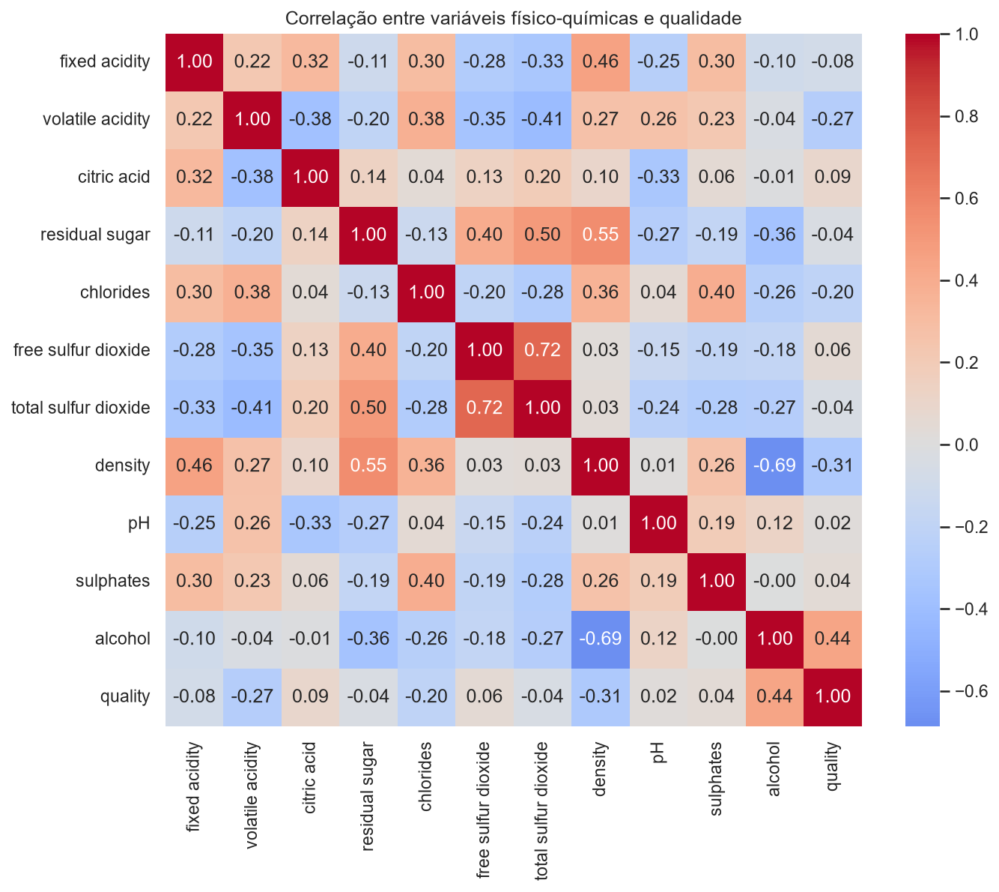

# Análise Exploratória (EDA)

## Distribuição das notas de qualidade

A primeira pergunta é simples: como as notas de qualidade estão distribuídas
entre tintos e brancos?

<figure markdown="span">
  
  <figcaption>Distribuição das notas de qualidade, separadas por tipo de vinho</figcaption>
</figure>

A grande maioria dos vinhos — tintos e brancos — recebe nota **5 ou 6**. Notas
extremas (3, 4, 8 ou 9) são raras. Esse desbalanceamento é importante: ele limita
a capacidade de qualquer modelo de generalizar bem para vinhos excepcionalmente
bons ou ruins, simplesmente porque há poucos exemplos desses casos para aprender.

## Correlação entre variáveis

Em seguida, olhamos para como as 11 variáveis físico-químicas se relacionam
entre si e com a nota de qualidade.

<figure markdown="span">
  
  <figcaption>Correlação de Pearson entre as variáveis físico-químicas e a qualidade</figcaption>
</figure>

Os destaques do mapa de correlação:

- **Álcool** é a variável mais correlacionada com a qualidade (correlação
  positiva) — vinhos com maior teor alcoólico tendem a receber notas mais altas.
- **Acidez volátil** tem correlação negativa com a qualidade — quanto maior a
  acidez volátil, pior a nota, o que faz sentido sensorialmente (esse composto
  está associado ao gosto de vinagre).
- **Densidade** e **açúcar residual** aparecem fortemente correlacionadas entre
  si, o que é esperado do ponto de vista físico-químico.
- Nenhuma variável isolada explica a qualidade sozinha — os coeficientes são
  moderados, sugerindo que a qualidade é resultado da **combinação** de várias
  propriedades, e não de um único fator dominante.

Essas duas primeiras observações (álcool e acidez volátil) foram testadas
formalmente na próxima etapa: [Probabilidade e Inferência →](inferencia.md)
