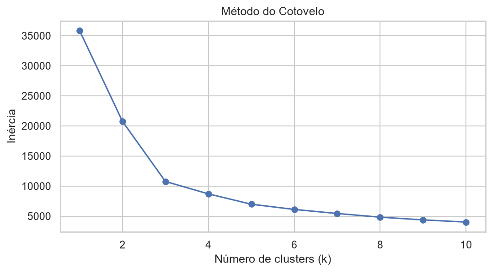
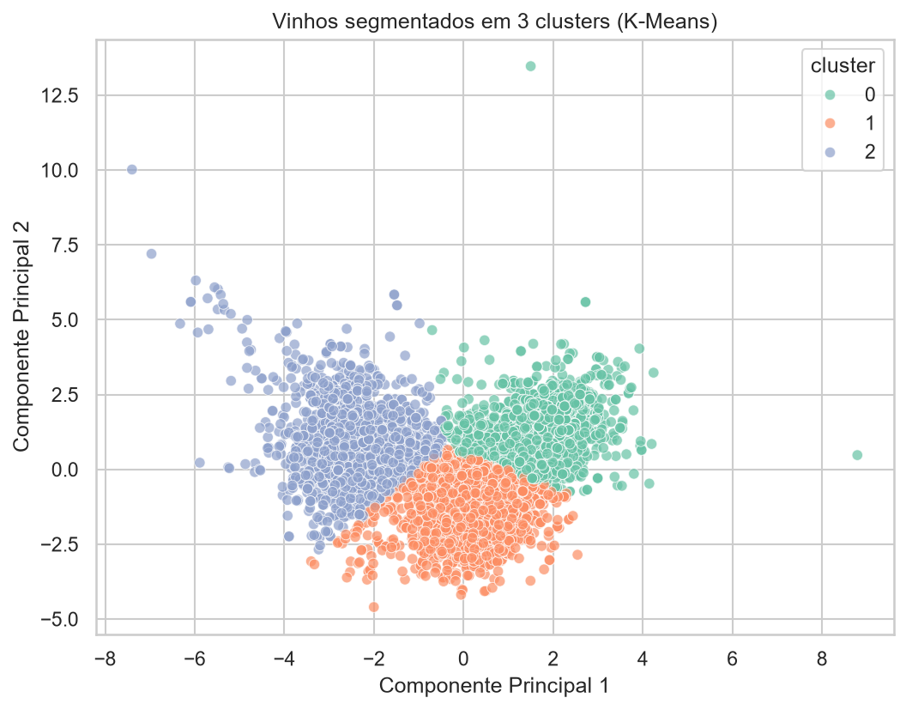

# K-Means — Segmentação de Perfis de Vinho

Com os vinhos projetados em 2 componentes principais (ver [PCA](pca.md)), o
próximo passo é verificar se existem agrupamentos naturais — perfis de vinho
que compartilham características físico-químicas semelhantes.

## Escolha do número de clusters (método do cotovelo)

```python
inercias = []
k_range = range(1, 11)
for k in k_range:
    km = KMeans(n_clusters=k, random_state=42, n_init=10)
    km.fit(X_pca_2d)
    inercias.append(km.inertia_)
```

<figure markdown="span">
  
  <figcaption>Inércia em função do número de clusters (k)</figcaption>
</figure>

O gráfico mostra uma inflexão clara em **k = 3**: a partir desse ponto, adicionar
mais clusters reduz a inércia cada vez menos, sem trazer ganho proporcional de
separação.

!!! info "Por que k = 3?"
    Além da inflexão no método do cotovelo, k = 3 tem uma vantagem prática: os
    três clusters mapeiam naturalmente para faixas de qualidade baixa, média e
    alta, o que dá **interpretabilidade de negócio** direta ao resultado — um
    critério tão importante quanto a métrica estatística isolada.

## Clusters finais

```python
kmeans = KMeans(n_clusters=3, random_state=42, n_init=10)
df["cluster"] = kmeans.fit_predict(X_pca_2d)
```

<figure markdown="span">
  
  <figcaption>Vinhos segmentados em 3 clusters, projetados nos componentes principais</figcaption>
</figure>

## Perfis identificados

| Cluster | Perfil            | Álcool médio | Acidez volátil | Sulfatos | Nota predominante |
| ------- | ------------------ | ------------- | ---------------- | --------- | ------------------- |
| 0       | Baixa qualidade    | ~9,5%         | Mais alta         | Mais baixos | Notas mais baixas |
| 1       | Qualidade média     | Intermediário | Intermediária      | Intermediários | 5–6 |
| 2       | Alta qualidade      | ~11–12%       | Mais baixa         | Mais altos | Notas mais altas |

Esse resultado reforça, de forma independente, o que já havia aparecido na
[inferência estatística](inferencia.md): álcool e acidez volátil são os
principais eixos que separam vinhos de qualidades diferentes — só que agora
descobertos de forma **não supervisionada**, sem usar a coluna `quality`
diretamente no agrupamento.

Próximo passo: [Regressão e Comparação de Modelos →](regressao.md)
