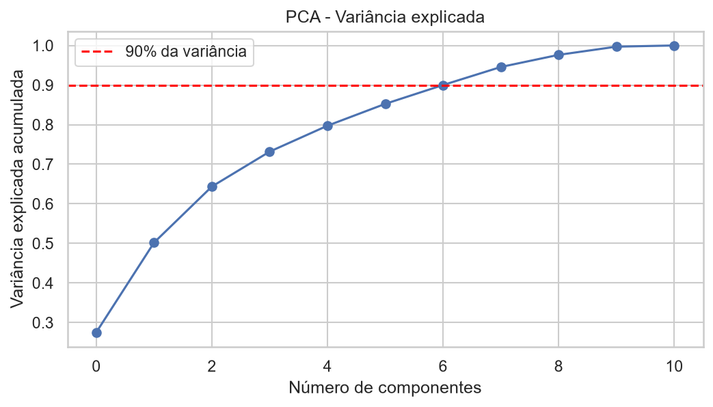
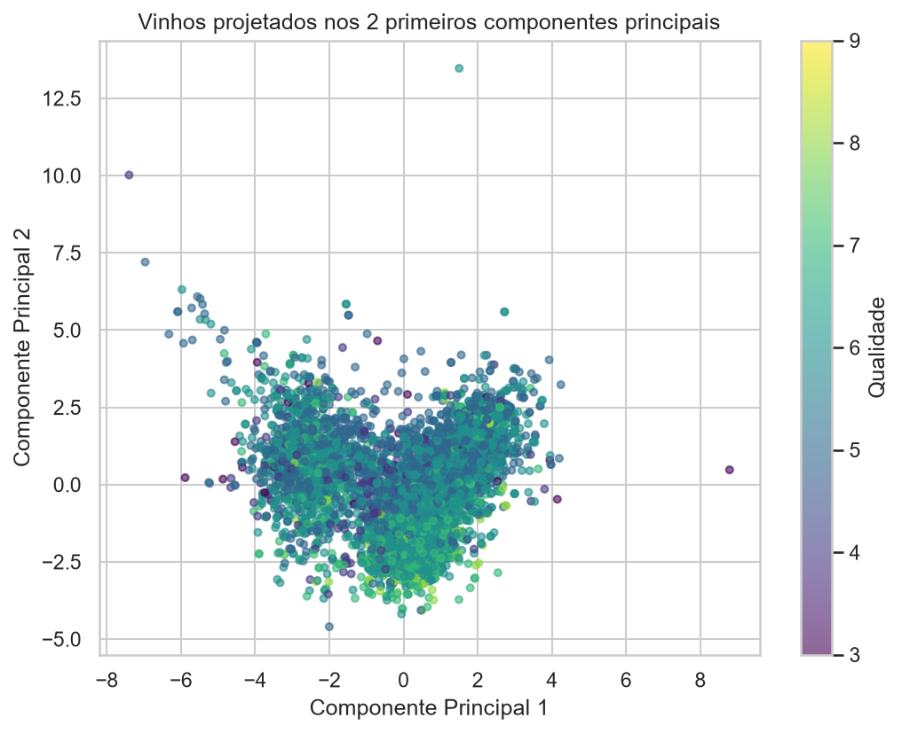

# PCA — Redução de Dimensionalidade

O dataset tem 11 variáveis físico-químicas. Antes de segmentar os vinhos em
perfis (próxima etapa, [K-Means](kmeans.md)), é útil reduzir essa
dimensionalidade para algo mais fácil de visualizar e trabalhar — essa é a
função da Análise de Componentes Principais (PCA).

## Padronização

Como as variáveis têm escalas muito diferentes (por exemplo, `density` varia
entre 0,99 e 1,04, enquanto `total sulfur dioxide` varia entre 6 e 440), todas
as 11 variáveis foram padronizadas (`StandardScaler`) antes do PCA, para que
nenhuma domine o resultado apenas por ter uma escala numérica maior.

## Variância explicada

```python
pca = PCA()
X_pca = pca.fit_transform(X_scaled)
```

<figure markdown="span">
  
  <figcaption>Variância explicada acumulada em função do número de componentes</figcaption>
</figure>

O gráfico mostra o quanto da variância total dos dados é capturado à medida que
mais componentes principais são adicionados, com uma linha de referência em
90%. Como a curva sobe de forma relativamente gradual, isso indica que a
informação físico-química dos vinhos está distribuída entre várias variáveis,
sem um ou dois fatores que dominem isoladamente — coerente com o que já havia
sido observado no mapa de correlação da [Análise Exploratória](eda.md).

## Projeção em 2 componentes

Para fins de visualização e como entrada para o K-Means, os dados foram
projetados nos dois primeiros componentes principais:

```python
pca_2d = PCA(n_components=2)
X_pca_2d = pca_2d.fit_transform(X_scaled)
```

<figure markdown="span">
  
  <figcaption>Vinhos projetados em 2 componentes principais, coloridos pela nota de qualidade</figcaption>
</figure>

Mesmo em apenas duas dimensões, é possível notar um gradiente de cor: vinhos
com notas mais altas tendem a se concentrar em regiões específicas do espaço
reduzido, o que sugere que existe estrutura suficiente nos dados para tentar uma
segmentação — o próximo passo.

Próximo passo: [K-Means →](kmeans.md)
