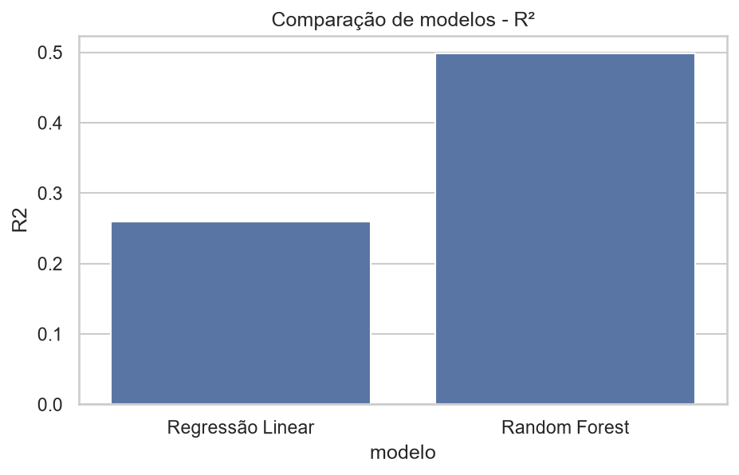

# Regressão e Comparação de Modelos

A etapa final do pipeline responde à pergunta central do projeto: **dado o
perfil físico-químico de um vinho, qual modelo prevê melhor a sua nota de
qualidade?**

## Modelos comparados

Foram treinados e comparados dois modelos, com separação treino/teste de 80/20:

```python
X_train, X_test, y_train, y_test = train_test_split(
    X_scaled, df["quality"], test_size=0.2, random_state=42
)

modelos = {
    "Regressão Linear": LinearRegression(),
    "Random Forest": RandomForestRegressor(n_estimators=200, random_state=42),
}
```

- **Regressão Linear** — modelo simples, assume relação linear entre as
  variáveis e a qualidade.
- **Random Forest** (combinação de modelos / ensemble) — combina centenas de
  árvores de decisão, capaz de capturar relações não lineares e interações
  entre variáveis.

## Resultados

| Modelo             | RMSE      | R²        |
| -------------------- | ---------- | ---------- |
| Regressão Linear      | 0,739      | 0,260      |
| **Random Forest**     | **0,609**  | **0,498**  |

<figure markdown="span">
  
  <figcaption>Comparação de desempenho (R²) entre Regressão Linear e Random Forest</figcaption>
</figure>

!!! success "Melhor modelo: Random Forest"
    O Random Forest reduziu o erro (RMSE) em cerca de 18% e quase dobrou o R²
    em relação à Regressão Linear. Isso indica que a relação entre as
    propriedades físico-químicas e a qualidade **não é puramente linear** — há
    interações entre variáveis (por exemplo, o efeito do álcool pode depender do
    nível de acidez volátil) que só um modelo não linear consegue capturar.

    **Validação cruzada (5-fold):** R² médio = 0,49 (±0,02), confirmando robustez
    e baixa variância do modelo.

## Variáveis mais importantes

A partir da importância de variáveis (*feature importance*) do Random Forest,
os principais fatores para prever a qualidade são, em ordem de relevância:

1. `alcohol`
2. `sulphates`
3. `volatile acidity`
4. `density`

Esse resultado é consistente com o que já havia aparecido tanto no [mapa de
correlação](eda.md) quanto na [inferência estatística](inferencia.md) — um bom
sinal de que as conclusões do projeto são robustas e não dependem de uma única
técnica.

Veja as [conclusões e aplicações práticas →](../conclusoes.md)
